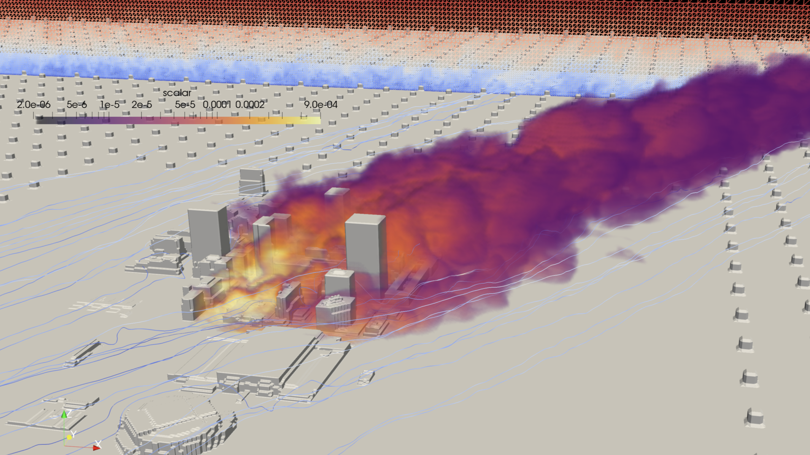

# About
[CityLBM](https://link.springer.com/article/10.1007/s10546-020-00594-x) code simulates wind flows in an urbal area. 
It employs the Lattice Boltmann method and an local mesh-refinement method to achieve a real-time simulation in the complex urban environment, such as Oklahoma City. 

# Supported devices
CityLBM was originally developed for Nvidia GPUs, but it was recently ported to the many-core CPU machine including Fugaku and Flow.
We have tested the code on the following environments. 

1. GPU environments
    1.  Nvidia Tesla P100 on Tsubame3.0 (Tokyo Tech, Japan)  
Compilers (cuda/10.2.89, openmpi/3.1.4-opa10.10)

    1.  Nvidia Tesla V100 on SGI8600 (JAEA, Japan)  
Compilers (gcc/7.4.0, mpt/2.23-ga, cuda/11.0)

    1.  Nvidia Tesla A100 on Aquarius (Univ Tokyo, Japan)  
Compilers (gcc/8.3.1, cuda/11.2, ompi-cuda/4.1.1-11.2)

1. CPU environments
    1.  Intel Broadwell on Tsubame3.0 (Tokyo Tech, Japan)       
Compilers (itnel/19.1.0.166, intel-mpi/19.6.166)

    1.  Fujitsu A64FX on Fugaku (Riken, Japan)  
Compilers (Fujitsu compiler)

    1.  Fujitsu A64FX on Flow (Nagoya Univ, Japan)  
Compilers (Fujitsu compiler)

# Usage
## Compile
Firstly, you need to get the source code by
```
git clone git@github.com:hasegawa-yuta-jaea/citylbm.git
```

Depending on your configuration, you may have to modify the [Makefile](https://github.com/hasegawa-yuta-jaea/citylbm/blob/master/makefile) and add a new config file in the [config directory for each device](https://github.com/hasegawa-yuta-jaea/citylbm/tree/master/config/devices).  
We strongly recommend to add the following lines in ```~/.bash_profile``` as :
```bash
export SUPERCOMPUTER = <New_supercomputer_name>
export DEVICE = <Device_name>
```
Hereinafter, it is assumed that ```SUPERCOMPUTER``` is set as ```<New_supercomputer_name>``` and ```DEVICE``` is set as ```<Device_name>```. Examples of ```SUPERCOMPUTER``` and ```DEVICE``` are found in [the guide to job submission](https://github.com/hasegawa-yuta-jaea/citylbm/blob/master/doc/Job-Submission-Guide.md).

Then, a new config file ```<Device_name>``` should be placed in the [config directory for each device](https://github.com/hasegawa-yuta-jaea/citylbm/tree/master/config/devices). Here is the example for ```A100``` device.

```Makefile
# Nvidia Tesla A100 on Wisteria (Univ. Tokyo, Japan)
COMPILER  = nvcc
CXXFLAGS  = -arch=sm_80 -x cu -O3 -std=c++14 -restrict --expt-extended-lambda -use_fast_math --default-stream per-thread
CXXFLAGS += -maxrregcount 127 --nvlink-options -Werror
CXXFLAGS += -ccbin mpicxx
LDFLAGS = -lm -lstdc++ -lz
TARGET = $(OUT_DIR)/citylbm.A100_cuda

citylbm_addopt += NO_IOTHREAD

# Linker
LINKER = nvcc -ccbin mpicxx
```
In general, the changes should be trivial for known devices like Nvidia GPUs and Intel CPUs. 
It may be the easiest to copy a config file for a device offered by the same vendor as yours, and modify some of compilation flags. 
It is also important to name the ```TARGET``` as ```citylbm.<Device_name>_<Programming_Framework_name>```. 

The following table summarizes the programming framework we use.
| `<Programming_Framework_name>` | Devices |
| --- | --- |
| `cuda` | Nvidia GPUs (P100, V100, A100) |
| `hip` | AMD GPUs (MI100) |
| `omp` | CPUs (A64FX, bdw) |


## Run
A helper is used to submit jobs on multiple platforms. The helper relys on ```python 3.4``` or later.
You need to place ```<your_input_file>.json``` on ```run/jobs```. For example, you can run citylbm on SGI8600 by
```
cd run
python sub.py example_sgi8600.json --dir ./foo
```
The helper automatically generates the job script on the specified environment followed by the job submission. If you place your ```<your_input_file>.json``` on ```run/foo```, the optional argument ```--dir``` (default: ```./jobs```) should be set as ```./foo```. See [the guide to job submission](https://github.com/hasegawa-yuta-jaea/citylbm/blob/master/doc/Job-Submission-Guide.md) for detail.

# Publications
1. N. Onodera, Y. Idomura, Y. Hasegawa, H. Nakayama, T. Shimokawabe, and T. Aoki, "Real-time tracer dispersion simulation in Oklahoma City using locally-mesh refined lattice Boltzmann method," Boundary-Layer Meteorol., 2021, doi: 10.1007/s10546-020-00594-x.

1. N. Onodera, Y. Idomura, S. Uesawa, S. Yamashita, and H. Yoshida, "Locally mesh-refined lattice Boltzmann method for fuel debris air cooling analysis on GPU supercomputer," Mech. Eng. J., 2020, doi: 10.1299/mej.19-00531.

1. N. Onodera, Y. Idomura, S. Uesawa, S. Yamashita, and H. Yoshida, "Fuel debris' air cooling analysis using a lattice Boltzmann method
," Proc. ICONE-27, 2019.

1. N. Onodera, Y. Idomura, Y. Ali, and T. Shimokawabe, "Communication Reduced Multi-time-step Algorithm for Real-time Wind Simulation on GPU-based Supercomputers," 2018 IEEE/ACM 9th Work. Latest Adv. Scalable Algorithms Large-Scale Syst., pp. 9–16, 2018, doi: 10.1109/ScalA.2018.00005
1. N. Onodera, Y. Idomura, "Acceleration of plume dispersion simulation using locally mesh-refined lattice Boltzmann method," Proc. ICONE-26, 2018.
1. N. Onodera and Y. Idomura, “Acceleration of wind simulation using locally mesh-refined lattice Boltzmann method on GPU-rich supercomputers,” in Supercomputing Frontiers, SCFA 2018 Lecture Notes, 2018, vol. 10776 LNCS, pp. 128–145, doi: 10.1007/978-3-319-69953-0_8.
