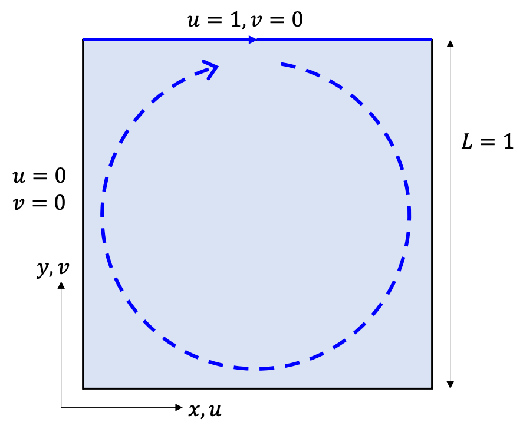
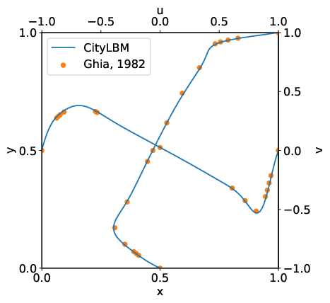

# Benchmark test: 2D lid-driven cavity flow

This document describes how to run the benchmark test of the 2D lid-driven cavity flow by `CityLBM`.

### Overview

The cavity flow is a well-known benchmark test of the imcomporessible isothermal single-phase flow, firstly tested by U. Ghia et al [[ *J. Comput. Phys.*, 48, 387–411 (1982)](https://doi.org/10.1016/0021-9991(82)90058-4)]. As shown in Figure 1, the computational domain is deined as a square geometry, surrounded by walls. The top lid is the moving wall with constant velocity, and other three walls are fixed.



Figure 1: Geometry and boundary condition of cavity flow.


`CityLBM` has the preset of the cavity flow configuration. It is defined in 

- `validation_srcs/TestCavity.cu` : hard-coded initialization routines
- `config/tests/cavity` : macro definitions
- `run/regression_tests/cavity/sgi8600.json` : input file for the job submission helper
- `run/regression_tests/cavity/postprocess/*` : python scripts for the postprocess

Understanding those files is optional, but it may be helpful for first tutorial to join the development of `CityLBM`.

### Run the code

#### job submission

Clone the code on the JAEA supercomputer SGI8600. Since there is a preset of the cavity flow, user can submit the job by just executing following commands:

```
cd run/regression_tests/cavity
make run
```

Once the job starts, exsecution log will be printed in `run/regression_tests/cavity/build/run/result/cavity_V100_Nodes1_MPI4/log/logfile_0.txt`.

#### postproceesing

An example of postprocess script can be found in `run/regressoin_tests/cavity/postprocess/plot.py` (requirements: python3, with the libraries `numpy`, `pandas`, and `matplotlib`). 
By executing the following commands, you will get the result as Figure 2. 

```
cd run/regression_tests/cavity/postprocess
./plot.py
```



Figure 2: Example of velocity profile of the cavity flow (Re = 1000). The vertical velocity component on horizontal midsection, the horizontal velocity component on vertical midsection.


Furthermore, the VTK files will be generated in `run/regression_tests/cavity/build/run/cavity_V100_Nodes1_MPI4/io/iofiles/*.pvtu`. Users can try some visuallizations using ParaView [https://www.paraview.org] along with their own interests.

#### parameter studies

##### change Reynolds number (TBA)

##### change mesh resolusion (TBA)